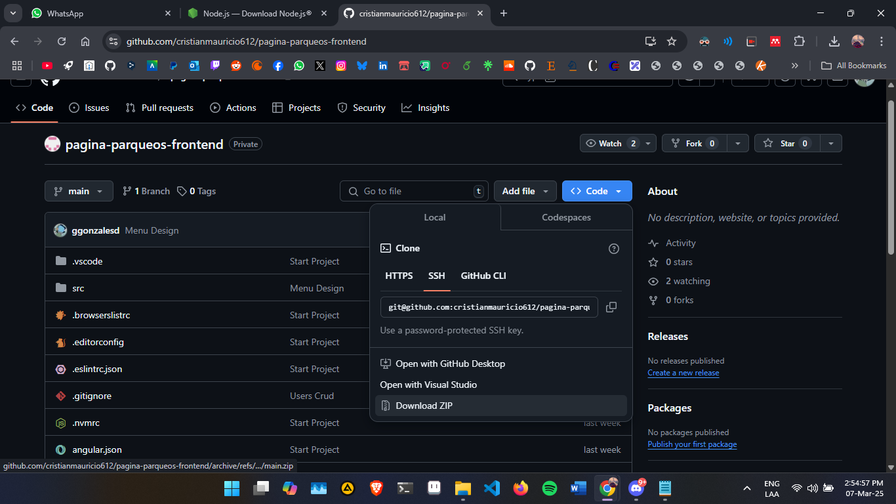

# 1. Descargar e instalar Node v22

Click en Windows Installer (.msi)


# 2. Descargar y extraer el proyecto frontend



# 3. Abrir la terminal en el proyecto extraido


# 4. Instalar el @ionic/cli

```bash
npm i -g @ionic/cli
```


# 5. Instalar dependecias del proyecto

```bash
npm i
```


# 6. Iniciar servidor de ionic

```bash
ionic serve
```


# 7. Vista del login


# 8. Login

- Intentar con correos que inicien con `admin` para probar con el rol de administrador (ej. admin@123, admin@gmail.com)
- Intentar con correos que inicien con `empleado` para probar con el rol de administrador (ej. empleado@123, empleado@gmail.com)
- Cualquier otro correo se considera cliente.


# 9. Vista de la webapp


